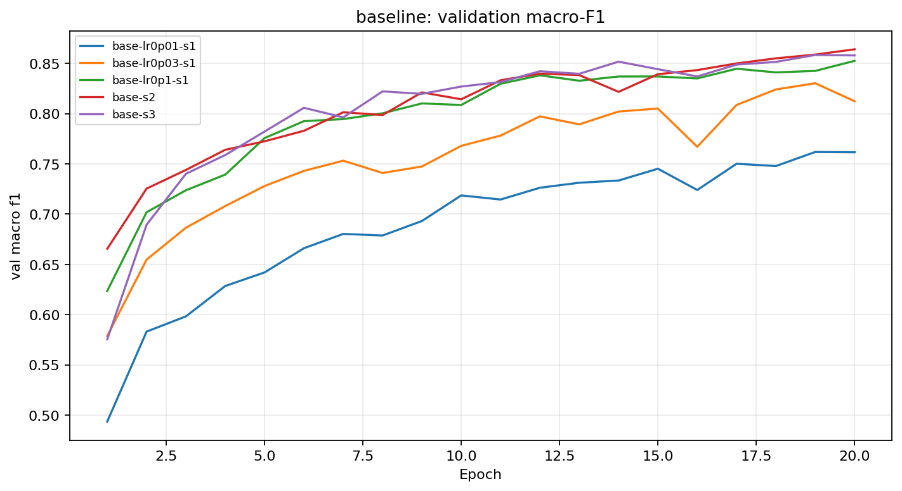

# Lab Day 1 report - 2A202603012

Generated from measured runs. Review the interpretations and add your name before submission.

## 1. Setup

Python 3.13.15; PyTorch 2.11.0+cu130; GPU: Tesla T4.
Official 80/20 train/eval metadata; stratified validation 20% of training rows, seed 42. Training rows=371847; validation rows=92962. Only the first ten columns are standardized using training statistics.
M-base: 54-256-128-7, 47879 parameters. Baseline `base-lr0p1-s1`: SGD momentum 0.9, CE, He, lr=0.1, batch=512, epochs=20, FP32, no dropout or clipping. Majority-class validation accuracy=0.487597.
Every completed configuration uses the same epoch budget and validation split. Checkpoint metrics come from each run's minimum-validation-loss epoch. Final configuration ranking uses validation macro-F1 at those checkpoints.

## 2. Initial checks and seed noise

Logits shape: [8, 7]; initial CE=2.269062; ln(7)=1.945910. Random logits need not be uniform, so the loss need not equal ln(7) exactly. Every parameter had a finite nonzero gradient. The 20-example check reached loss=0.000004, accuracy=1.000000 after 500 updates.
Baseline validation accuracy: 0.909705 +/- 0.002442. Baseline validation macro-F1: 0.854266 +/- 0.011894; 2-sigma=0.023788. This sample standard deviation over three seeds is a rough noise reference, not a statistical significance test.
Diagnostics are recorded in the workbook Legend sheet; baseline seed IDs are in Seeds.

## 3. Results by topic

| Experiment ID | Group | Validation accuracy | Validation macro-F1 | Best epoch | Diverged |
|---|---|---:|---:|---:|---|
| base-lr0p1-s1 | baseline | 0.906897 | 0.840989 | 18 | False |
| amp-fp16 | amp | 0.905725 | 0.845730 | 18 | False |
| base-lr0p01-s1 | baseline | 0.875831 | 0.761520 | 20 | False |
| base-lr0p03-s1 | baseline | 0.893344 | 0.824033 | 18 | False |
| base-s2 | baseline | 0.911340 | 0.863947 | 20 | False |
| base-s3 | baseline | 0.910878 | 0.857861 | 20 | False |
| batch-128 | hparam | 0.911846 | 0.860720 | 20 | False |
| clip-normal | clipping | 0.901089 | 0.841155 | 20 | False |
| dropout-0p3 | dropout | 0.871550 | 0.785274 | 20 | False |
| highlr-clip | clipping | 0.881102 | 0.817439 | 19 | False |
| highlr-no-clip | clipping | 0.869506 | 0.780358 | 19 | False |
| init-xavier | init | 0.902530 | 0.837379 | 17 | False |
| init-zeros | init | 0.487597 | 0.093650 | 10 | False |
| loss-mse | loss | 0.869893 | 0.725932 | 20 | False |
| opt-adam-lr0.0003 | optimizer | 0.872787 | 0.787445 | 20 | False |
| opt-adam-lr0.001 | optimizer | 0.901358 | 0.847647 | 20 | False |

### baseline

Prediction: Validation should identify an SGD learning rate that converges without large oscillations. Different seeds should expose training noise.
Learning rate was selected from 0.01, 0.03 and 0.1 using validation; only the selected rate's seeds enter the noise estimate.
`base-lr0p1-s1`: Best-checkpoint F1=0.840989, accuracy=0.906897, best epoch=18; F1 difference versus base-lr0p1-s1=+0.000000. Absolute difference does not exceed the baseline 2-sigma reference (0.023788). Momentum averages updates over recent gradients. Learning rate affects both progress and oscillation.

### loss

Prediction: Raw-logit MSE may converge differently from CE. Its loss scale is different, so compare accuracy and macro-F1.
`loss-mse`: Best-checkpoint F1=0.725932, accuracy=0.869893, best epoch=20; F1 difference versus base-lr0p1-s1=-0.115057. Absolute difference exceeds the baseline 2-sigma reference (0.023788). CE applies log-softmax to raw logits. MSE regresses seven raw logits toward one-hot targets and averages over all seven coordinates.

### optimizer

Prediction: Adam may converge faster, but the comparison must use a validation-tuned rate for each optimizer.
`opt-adam-lr0.0003`: Best-checkpoint F1=0.787445, accuracy=0.872787, best epoch=20; F1 difference versus base-lr0p1-s1=-0.053544. Absolute difference exceeds the baseline 2-sigma reference (0.023788). Adam scales coordinate updates using moving averages of gradients and squared gradients. AdamW decouples weight decay; neither is automatically better.
`opt-adam-lr0.001`: Best-checkpoint F1=0.847647, accuracy=0.901358, best epoch=20; F1 difference versus base-lr0p1-s1=+0.006657. Absolute difference does not exceed the baseline 2-sigma reference (0.023788). Adam scales coordinate updates using moving averages of gradients and squared gradients. AdamW decouples weight decay; neither is automatically better.

### hparam

Prediction: A smaller batch increases updates per epoch and gradient noise; it may improve F1 at a higher time cost.
`batch-128`: Best-checkpoint F1=0.860720, accuracy=0.911846, best epoch=20; F1 difference versus base-lr0p1-s1=+0.019731. Absolute difference does not exceed the baseline 2-sigma reference (0.023788). Batch=128; time per epoch=5.149s. At fixed epochs, batch 128 produces about four times as many updates as batch 512. Time and update count therefore change with batch size.

### dropout

Prediction: Dropout 0.3 should reduce a genuine generalization gap; it may hurt if the baseline is still underfitting.
`dropout-0p3`: Best-checkpoint F1=0.785274, accuracy=0.871550, best epoch=20; F1 difference versus base-lr0p1-s1=-0.055715. Absolute difference exceeds the baseline 2-sigma reference (0.023788). Final loss gap=0.003498 versus reference gap=0.018329. Randomly masking hidden activations regularizes co-adaptation. Train loss is measured with dropout disabled to make the gap interpretable.

### clipping

Prediction: Clipping should cap large updates. A matched high-rate pair tests whether it improves stability; recovery is not guaranteed.
`clip-normal`: Best-checkpoint F1=0.841155, accuracy=0.901089, best epoch=20; F1 difference versus base-lr0p1-s1=+0.000166. Absolute difference does not exceed the baseline 2-sigma reference (0.023788). Mean epoch clipping fraction=0.9898. Global norm clipping rescales gradients by min(1, threshold/norm), limiting sudden update magnitudes without fixing bad labels or an unsuitable rate.
`highlr-clip`: Best-checkpoint F1=0.817439, accuracy=0.881102, best epoch=19; F1 difference versus highlr-no-clip=+0.037081. Absolute difference exceeds the baseline 2-sigma reference (0.023788). Mean epoch clipping fraction=0.0054. Global norm clipping rescales gradients by min(1, threshold/norm), limiting sudden update magnitudes without fixing bad labels or an unsuitable rate.
`highlr-no-clip`: Best-checkpoint F1=0.780358, accuracy=0.869506, best epoch=19; F1 difference versus base-lr0p1-s1=-0.060631. Absolute difference exceeds the baseline 2-sigma reference (0.023788). Mean epoch clipping fraction=0.0000. Global norm clipping rescales gradients by min(1, threshold/norm), limiting sudden update magnitudes without fixing bad labels or an unsuitable rate.

### amp

Prediction: FP16 should have similar F1 to FP32. Speed and memory gains may be small for this compact MLP.
`amp-fp16`: Best-checkpoint F1=0.845730, accuracy=0.905725, best epoch=18; F1 difference versus base-lr0p1-s1=+0.004740. Absolute difference does not exceed the baseline 2-sigma reference (0.023788). Epoch time ratio to FP32=1.363; peak allocated GPU MiB=200.37. FP16 has a narrow exponent range; GradScaler limits gradient underflow and skips overflow updates. BF16 has a wider range, but requires hardware support.

### init

Prediction: Xavier may change activation scale. Zero weights preserve symmetry and leave hidden ReLU gradients zero.
`init-xavier`: Best-checkpoint F1=0.837379, accuracy=0.902530, best epoch=17; F1 difference versus base-lr0p1-s1=-0.003611. Absolute difference does not exceed the baseline 2-sigma reference (0.023788). Initial activation standard deviations=[0.2780497372150421, 0.2202722579240799, 0.196858748793602]. He uses variance 2/fan_in for ReLU; Xavier uses 2/(fan_in+fan_out). At zero initialization, ReLU derivatives block hidden-layer learning.
`init-zeros`: Best-checkpoint F1=0.093650, accuracy=0.487597, best epoch=10; F1 difference versus base-lr0p1-s1=-0.747339. Absolute difference exceeds the baseline 2-sigma reference (0.023788). Initial activation standard deviations=[0.0, 0.0, 0.0]. He uses variance 2/fan_in for ReLU; Xavier uses 2/(fan_in+fan_out). At zero initialization, ReLU derivatives block hidden-layer learning.

BF16 was skipped because the GPU does not support it; FP16 remains the tested precision comparison.

## 4. Final evaluation

Configuration and seed were frozen in selection.json before reading eval scores. Eval was used only for the designated baseline and final configuration.

| Configuration | Experiment ID | Seed | Eval accuracy | Eval macro-F1 |
|---|---|---:|---:|---:|
| Baseline | base-lr0p1-s1 | 1 | 0.904340 | 0.842746 |
| Final | batch-128 | 1 | 0.910915 | 0.863473 |

Final minus baseline eval F1=+0.020727. Eval seed uncertainty was not measured; validation seed noise cannot establish eval significance.

### Per-class errors

| Class | Support | Precision | Recall | F1 |
|---|---:|---:|---:|---:|
| 0 | 42368 | 0.905580 | 0.909790 | 0.907680 |
| 1 | 56661 | 0.924655 | 0.924851 | 0.924753 |
| 2 | 7151 | 0.901046 | 0.915536 | 0.908233 |
| 3 | 549 | 0.819188 | 0.808743 | 0.813932 |
| 4 | 1899 | 0.797446 | 0.723539 | 0.758697 |
| 5 | 3473 | 0.870801 | 0.776274 | 0.820825 |
| 6 | 4102 | 0.885431 | 0.936373 | 0.910190 |

The lowest F1 is class 4 (0.758697), most often confused with class 1. Class imbalance and overlapping features are plausible causes. Feature analysis or a controlled class-weight experiment would test these hypotheses.

## 5. Guiding questions

Optimizer conclusions apply to the tested rates, epoch budget and seeds. Dropout is useful only when the measured gap and validation scores support it. Clipping limits update spikes; its activation fraction and matched high-rate curves are the evidence. The precision time ratios above determine whether AMP was faster. Zero initialization blocks hidden ReLU gradients; He and Xavier use different variances.

If loss does not decrease after 2,000 updates, first inspect feature scale, label range and initial CE. Second, overfit 20 samples with regularization disabled to test the training pipeline. Third, inspect each parameter's gradient and verify finite updates, zero_grad, learning rate and AMP unscaling. These checks distinguish data problems, disconnected or dead activations, and update-loop problems before changing architecture.

## 6. Limitations and unexpected outcomes

Only baseline noise is measured across three seeds; most topic trials use one seed. The 2-sigma rule is descriptive and multiple configuration searches can overfit validation. MSE and CE require different learning-rate tuning; here only loss changes, so this is a controlled comparison at the baseline rate. Batch sizes change update count at fixed epochs. GPU timings include evaluation and checkpoint copies and vary with runtime load. Memory is peak allocated MiB, including resident data, rather than total GPU reservation. A 10x-rate clipping stress test may remain stable or fail despite clipping; neither outcome should be misreported. Additional repeated topic seeds and broader independent learning-rate searches would strengthen conclusions.

## 7. Files and traceability

experiments.xlsx preserves the four official sheets; results/<exp_id>.json stores measured histories; figures/<exp_id>.png records every run. predictions_eval.csv and eval_result.json use the official scorer. The code folder contains the executable notebook and all implementation modules. Model checkpoints and data are excluded from the submission.
