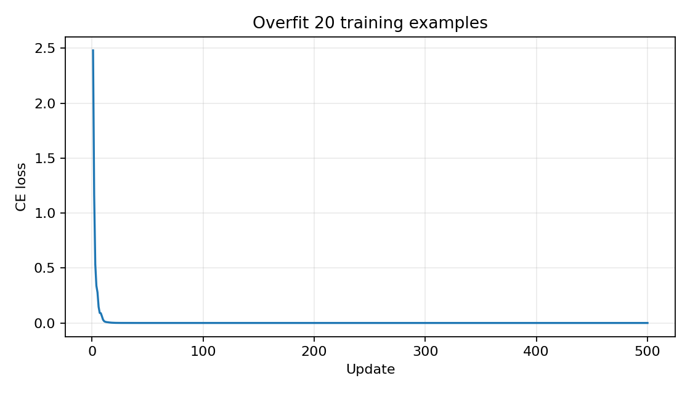
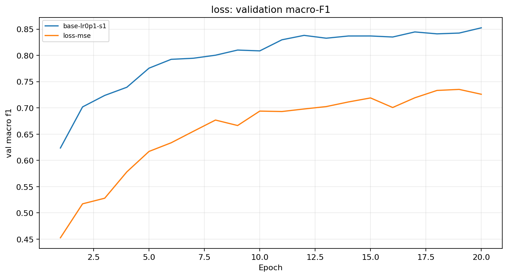
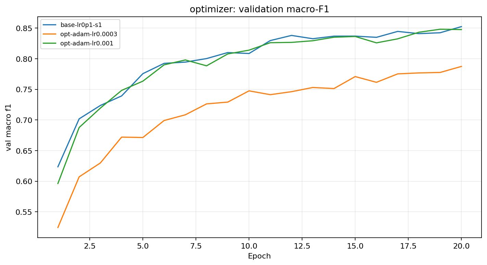
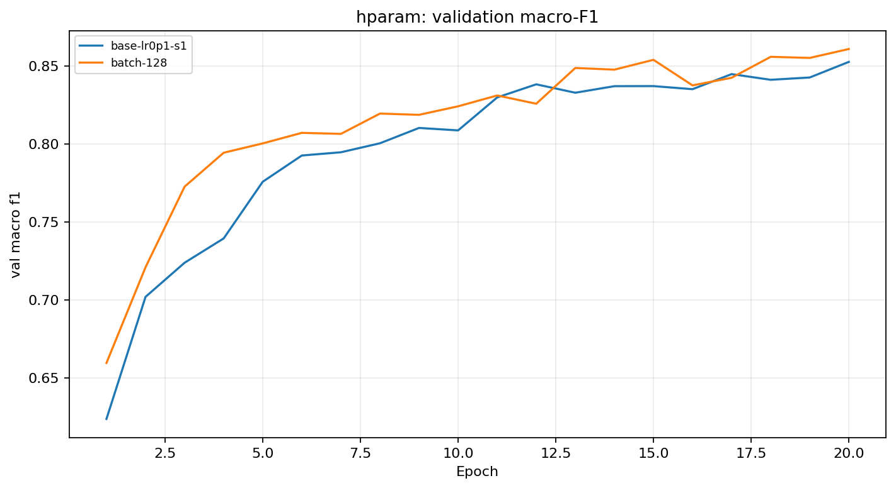
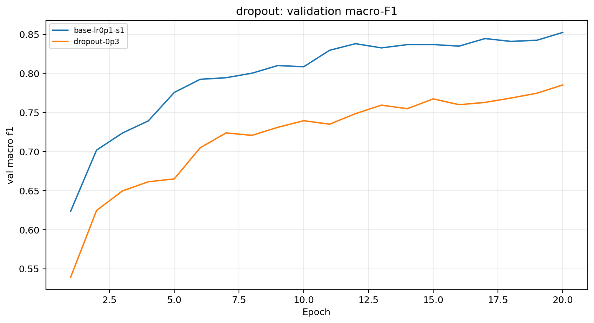
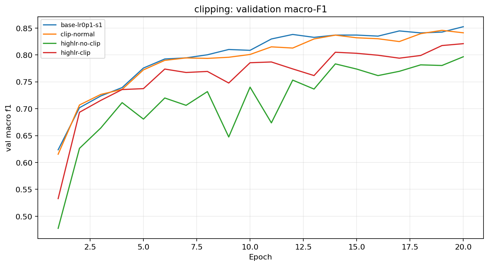
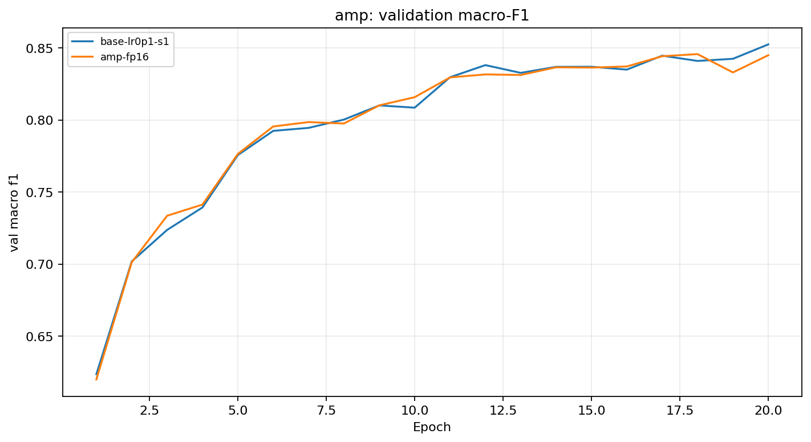
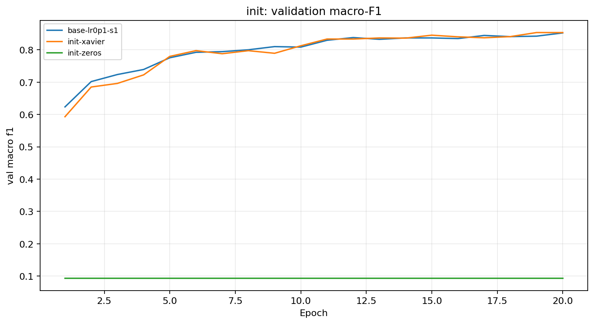
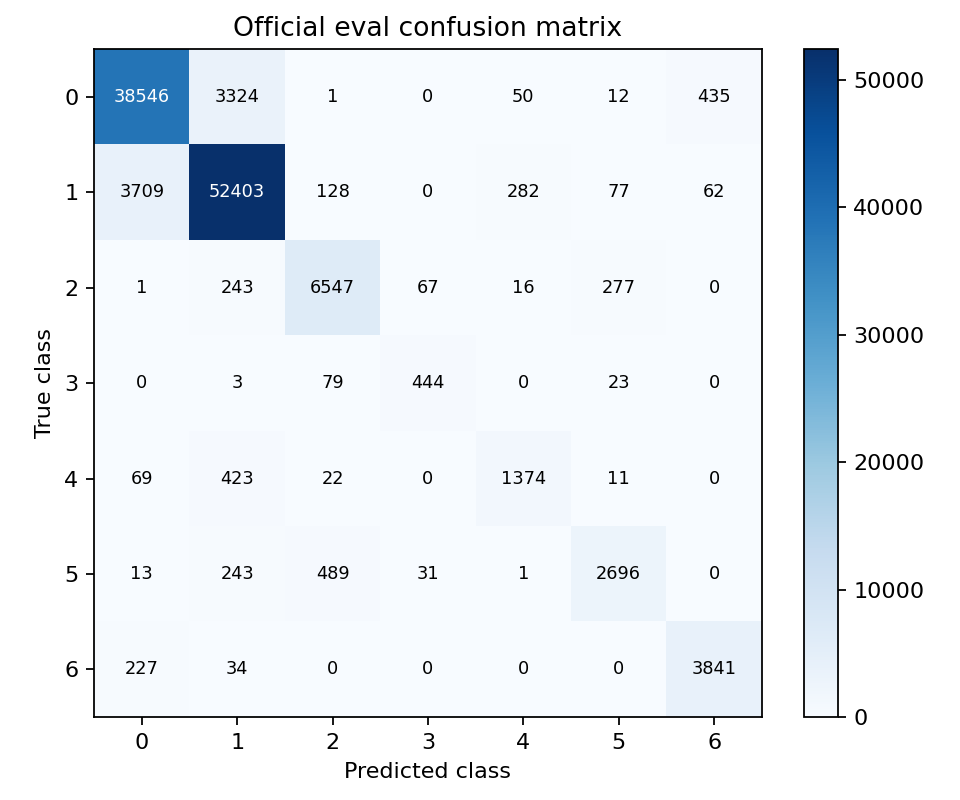

# Báo cáo Lab Day 1 — Bùi Quang Vinh — 2A202603012

## 1. Thiết lập

- Môi trường: Google Colab, Python 3.13.15, PyTorch 2.11.0+cu130, GPU Tesla T4.
- Dữ liệu: Forest CoverType; train 464 809 / eval 116 203 theo cách chia chính thức. Validation = 20% của train, phân tầng với seed 42 → 371 847 train / 92 962 val. Chỉ 10 đặc trưng số đầu tiên được chuẩn hoá bằng thống kê của tập train.
- Model: M-base (54→256→128→7, 47 879 tham số), activation ReLU.
- Baseline: Cross-Entropy, SGD momentum 0.9, lr=0.1, batch=512, 20 epochs, khởi tạo He, FP32, không dropout, không gradient clipping. exp_id tham chiếu: **base-lr0p1-s1**.
- Mốc tham chiếu: accuracy của chiến lược “đoán lớp đa số” trên val = **0.487597**.
- Các chủ đề đã thử: ☑ loss ☑ optimizer ☑ hyper-parameter ☑ dropout ☑ clipping ☑ mixed precision ☑ init

## 2. Kiểm tra ban đầu và độ nhiễu

| Kiểm tra | Kết quả |
|---|---|
| Số tham số / shape logits | 47 879 / (B, 7) |
| Loss bước 0 (so với ln 7 = 1.946) | 2.269062 |
| Quá khớp 20 mẫu: loss cuối | 0.000004 sau 500 bước; accuracy = 1.000000 |
| Mọi tham số có gradient khác 0 | ☑ có |
| Baseline, số seed đã chạy | 3 seed |
| Baseline: val acc (TB ± σ) | 0.909705 ± 0.002442 |
| Baseline: val macro-F1 (TB ± σ) | 0.854266 ± 0.011894 |

**Ngưỡng nhiễu dùng trong báo cáo:** 2σ = **0.023788** theo val macro-F1. Đây là độ lệch chuẩn mẫu từ 3 seed baseline và chỉ được dùng như một mốc tham chiếu mô tả, không phải kiểm định ý nghĩa thống kê.

## 3. Kết quả theo chủ đề

### 3.1 Hàm mất mát — CE vs MSE

- **Dự đoán:** Cross-Entropy (CE) phù hợp hơn MSE cho bài toán phân loại đa lớp vì CE tối ưu trực tiếp xác suất lớp thông qua log-softmax, trong khi MSE hồi quy các logit về vector one-hot.
- **Kết quả:** CE với **base-lr0p1-s1** đạt val macro-F1 = **0.840989**, accuracy = **0.906897**, best epoch = 18. MSE với **loss-mse** đạt val macro-F1 = **0.725932**, accuracy = **0.869893**, best epoch = 20.
- Chênh lệch macro-F1 của MSE so với CE là **-0.115057**, lớn hơn ngưỡng nhiễu 2σ = 0.023788 về trị tuyệt đối.
- **Giải thích:** Với CE, gradient gắn trực tiếp với sai khác giữa xác suất dự đoán và nhãn thật. MSE phải đẩy bảy logit về các giá trị one-hot và còn lấy trung bình trên các toạ độ, nên động lực tối ưu khác đáng kể. Không so trực tiếp giá trị loss CE và MSE vì hai loss có thang đo khác nhau.

### 3.2 Bộ tối ưu hoá

- **Dự đoán:** Adam có thể hội tụ nhanh hơn, nhưng phải so sánh công bằng tại learning rate tốt nhất đã thử của từng optimizer.

| Optimizer | exp_id | lr | val macro-F1 | Best epoch |
|---|---|---:|---:|---:|
| SGD + momentum | base-lr0p1-s1 | 0.1 | 0.840989 | 18 |
| Adam | opt-adam-lr0.001 | 0.001 | 0.847647 | 20 |

- **Độ nhạy với learning rate:** SGD lần lượt đạt macro-F1 0.761520, 0.824033 và 0.840989 tại lr = 0.01, 0.03 và 0.1. Adam đạt 0.787445 tại lr = 0.0003 và 0.847647 tại lr = 0.001.
- Adam tại lr tốt nhất cao hơn SGD **+0.006657**, nhỏ hơn 2σ = 0.023788, vì vậy chưa đủ bằng chứng để kết luận Adam thực sự tốt hơn SGD.
- **Giải thích:** SGD momentum làm mượt cập nhật theo hướng gradient gần đây; Adam tự điều chỉnh bước cập nhật theo trung bình động của gradient và bình phương gradient. Kết quả cho thấy kết luận về optimizer phụ thuộc mạnh vào learning rate.

### 3.3 Hyper-parameter

- Yếu tố đã thay đổi chính là **batch size**: baseline batch=512 so với **batch-128**.
- **batch-128** đạt val macro-F1 = **0.860720**, accuracy = **0.911846**, best epoch = 20; cao hơn baseline **+0.019731**, nhưng vẫn nhỏ hơn 2σ = 0.023788.
- Thời gian mỗi epoch tăng từ khoảng **1.316 s** (batch 512) lên **5.149 s** (batch 128).
- Với cùng 20 epochs, batch 128 tạo xấp xỉ **4 lần số bước cập nhật** so với batch 512. Vì vậy đây không chỉ là thay đổi kích thước batch mà còn thay đổi số lần optimizer được cập nhật trong cùng ngân sách epoch.
- Kết quả tốt hơn về điểm val nhưng chi phí huấn luyện cao hơn rõ rệt; chênh lệch hiện tại chưa vượt ngưỡng nhiễu baseline.

### 3.4 Dropout

- Baseline có khoảng cách final train–val loss khoảng **0.018329**.
- Với **dropout-0p3**, khoảng cách này giảm còn **0.003498**, nhưng val macro-F1 giảm từ 0.840989 xuống **0.785274**.
- Mức giảm macro-F1 là **-0.055715**, vượt ngưỡng 2σ.
- Điều này cho thấy dropout đã làm giảm khoảng cách train–val, nhưng baseline chưa thể hiện overfitting đủ mạnh để việc regularize thêm mang lại lợi ích. Trong thí nghiệm này, dropout 0.3 khiến mô hình có xu hướng underfit hơn.

### 3.5 Gradient clipping

- Ở learning rate bình thường, **clip-normal** đạt val macro-F1 = **0.841155**, gần như bằng baseline 0.840989; chênh lệch chỉ +0.000166, nhỏ hơn 2σ.
- Tỉ lệ clipping trung bình theo epoch của **clip-normal** là **0.9898**, tức clipping kích hoạt gần như toàn bộ thời gian với ngưỡng đang dùng, nhưng không tạo cải thiện đáng kể.
- Ở learning rate cao, **highlr-no-clip** đạt macro-F1 = **0.780358**, còn **highlr-clip** đạt **0.817439**.
- Clipping cải thiện **+0.037081** trong cặp high-lr, lớn hơn 2σ. Tuy nhiên highlr-clip vẫn thấp hơn baseline 0.840989.
- **Kết luận:** Gradient clipping có thể hạn chế các bước cập nhật quá lớn và giúp huấn luyện ổn định hơn trong điều kiện learning rate căng, nhưng không tự sửa được một learning rate không phù hợp và không đảm bảo vượt baseline.

### 3.6 Mixed precision

| Chế độ | exp_id | Thời gian/epoch | Peak GPU memory | val macro-F1 |
|---|---|---:|---:|---:|
| FP32 | base-lr0p1-s1 | 1.316 s | 200.37 MiB | 0.840989 |
| FP16 | amp-fp16 | 1.794 s | 200.37 MiB | 0.845730 |
| BF16 | Không chạy | — | — | — |

- FP16 cao hơn baseline **+0.004740 macro-F1**, nhỏ hơn ngưỡng nhiễu.
- FP16 mất khoảng **1.363 lần** thời gian/epoch so với FP32, tức là chậm hơn trong thí nghiệm này.
- Peak allocated memory gần như không thay đổi vì MLP tương đối nhỏ và phần bộ nhớ cố định/dữ liệu chiếm tỷ trọng đáng kể.
- FP16 có dải số hẹp hơn nên dùng GradScaler để giảm nguy cơ underflow/overflow. **BF16 không được chạy do GPU hiện tại không hỗ trợ phù hợp.**
- **Kết luận:** Mixed precision không mang lại tăng tốc đo được trên mô hình và dữ liệu này.

### 3.7 Khởi tạo tham số

| Khởi tạo | exp_id | Std kích hoạt ban đầu theo lớp | Loss bước 0 | val macro-F1 |
|---|---|---|---:|---:|
| He | base-lr0p1-s1 | [0.6662, 0.6464, 0.5933] | 2.269062 | 0.840989 |
| Xavier | init-xavier | [0.2780, 0.2203, 0.1969] | 2.022176 | 0.837379 |
| Zeros | init-zeros | [0.0000, 0.0000, 0.0000] | 1.945910 | 0.093650 |

- Xavier thấp hơn He **-0.003611 macro-F1**, nhỏ hơn 2σ nên chưa có khác biệt rõ ràng.
- **init-zeros** chỉ đạt accuracy = **0.487597** và macro-F1 = **0.093650**, gần đúng hành vi đoán lớp đa số.
- Khởi tạo toàn 0 làm các neuron trong cùng lớp bắt đầu giống hệt nhau; với ReLU, các hidden activation bằng 0 và gradient qua các hidden layer bị chặn, nên mô hình không phá được đối xứng để học đặc trưng.
- He dùng phương sai xấp xỉ 2/fan_in, phù hợp với ReLU. Xavier dùng phương sai phụ thuộc cả fan_in và fan_out, thường phù hợp hơn khi muốn cân bằng phương sai qua lớp với các activation đối xứng hơn.

## 4. Đánh giá cuối trên tập eval

Cấu hình được chọn bằng validation trước khi đọc điểm eval. Theo selection.json, cấu hình cuối là **batch-128**, được chọn vì có val macro-F1 cao nhất trong các candidate seed 1 tại checkpoint có val loss thấp nhất.

| Cấu hình | Seed nộp | val macro-F1 | **eval macro-F1** | eval accuracy |
|---|---:|---:|---:|---:|
| Baseline (base-lr0p1-s1) | 1 | 0.840989 | **0.842746** | 0.904340 |
| Cấu hình cuối (batch-128) | 1 | 0.860720 | **0.863473** | 0.910915 |

- Cấu hình cuối chỉ thay batch size từ 512 xuống 128; các thành phần chính còn lại giữ theo baseline. Lý do chọn là điểm val macro-F1 cao nhất trong tập cấu hình đã thử.
- Trên eval, macro-F1 tăng **+0.020727** so với baseline. Con số này nhỏ hơn ngưỡng 2σ = 0.023788 đo trên validation, nhưng **eval chỉ chạy một seed**, vì vậy không thể dùng nhiễu validation để khẳng định ý nghĩa thống kê trên eval.
- Val và eval khá gần nhau: baseline lệch khoảng **+0.001757** (eval cao hơn val), còn cấu hình cuối lệch khoảng **+0.002753**. Không thấy dấu hiệu lệch phân phối lớn giữa val và eval qua hai điểm số này.

### 4.1 Phân tích lỗi theo lớp

| Lớp | support | precision | recall | F1 |
|---|---:|---:|---:|---:|
| 0 | 42 368 | 0.905580 | 0.909790 | 0.907680 |
| 1 | 56 661 | 0.924655 | 0.924851 | 0.924753 |
| 2 | 7 151 | 0.901046 | 0.915536 | 0.908233 |
| 3 | 549 | 0.819188 | 0.808743 | 0.813932 |
| 4 | 1 899 | 0.797446 | 0.723539 | 0.758697 |
| 5 | 3 473 | 0.870801 | 0.776274 | 0.820825 |
| 6 | 4 102 | 0.885431 | 0.936373 | 0.910190 |

- Lớp khó nhất là **lớp 4** với F1 = **0.758697**.
- Theo confusion matrix, lớp 4 bị nhầm nhiều nhất sang **lớp 1** với **423 mẫu**.
- Một nguyên nhân hợp lý là mất cân bằng dữ liệu và đặc trưng của lớp 4 có vùng chồng lấn với lớp khác. Thử nghiệm tiếp theo nên kiểm tra class weighting hoặc phân tích phân phối đặc trưng theo lớp trước khi thay đổi kiến trúc.

## 5. Trả lời các câu hỏi dẫn dắt

1. **Bộ tối ưu nào "thắng" khi mỗi cái được chỉnh lr công bằng? Khi lr không được chỉnh thì kết luận thay đổi ra sao?**  
   Trong các learning rate đã thử, Adam tốt nhất ở lr=0.001 với macro-F1 0.847647; SGD tốt nhất ở lr=0.1 với 0.840989. Adam cao hơn 0.006657 nhưng chưa vượt 2σ, nên chưa thể kết luận chắc chắn Adam thắng. Nếu dùng Adam lr=0.0003 thì macro-F1 chỉ 0.787445 và có thể tạo kết luận sai rằng Adam kém rõ rệt. Vì vậy phải tune learning rate riêng cho từng optimizer.

2. **Dropout có giúp không khi mô hình chưa quá khớp? Khi nào thì nên dùng?**  
   Không giúp trong thí nghiệm này. Dropout 0.3 giảm train–val loss gap từ 0.018329 xuống 0.003498 nhưng macro-F1 giảm 0.055715. Dropout nên được dùng khi có bằng chứng mô hình đang overfit, ví dụ train loss tiếp tục giảm trong khi val loss tăng hoặc khoảng cách train–val lớn và lặp lại ổn định qua seed.

3. **Gradient clipping giải quyết vấn đề gì? Quan sát nào của bạn chứng minh điều đó?**  
   Clipping giới hạn norm gradient để tránh bước cập nhật quá lớn khi gradient tăng đột biến. Bằng chứng rõ nhất là cặp high-lr: macro-F1 tăng từ 0.780358 không clipping lên 0.817439 khi clipping, chênh +0.037081 vượt 2σ. Tuy nhiên clipping không làm cấu hình high-lr vượt baseline, nên nó là cơ chế ổn định chứ không thay thế việc chọn learning rate phù hợp.

4. **Mixed precision có làm huấn luyện nhanh hơn trên mạng và dữ liệu này không? Vì sao (không)?**  
   Không. FP32 mất khoảng 1.316 s/epoch còn FP16 mất 1.794 s/epoch. MLP này nhỏ nên chi phí cast, GradScaler và các overhead khác có thể lớn hơn lợi ích Tensor Core; peak memory đo được cũng gần như bằng nhau. BF16 không được thử trên GPU hiện tại.

5. **Vì sao khởi tạo toàn số 0 hỏng? Khởi tạo He khác Xavier ở điểm nào và khi nào điều đó quan trọng?**  
   Khởi tạo 0 khiến các neuron đối xứng và tạo hidden activation bằng 0; với ReLU, gradient qua các hidden layer bị chặn nên các neuron không học được đặc trưng khác nhau. He dùng phương sai 2/fan_in để bù việc ReLU loại khoảng một nửa miền kích hoạt, nên thường phù hợp với mạng ReLU. Xavier dùng cả fan_in và fan_out để cân bằng phương sai truyền xuôi/ngược; khác biệt này quan trọng hơn khi mạng sâu hoặc activation khiến phương sai dễ co/giãn qua nhiều lớp.

6. **Một mạng có loss không giảm sau 2 000 bước: 3 phép kiểm tra đầu tiên là gì và vì sao?**  
   - **Kiểm tra dữ liệu và loss đầu vào:** xem scale đặc trưng, nhãn có đúng miền 0–6 hay không, logits có shape đúng và loss bước 0 có hữu hạn/hợp lý không. Mục tiêu là loại lỗi dữ liệu, nhãn hoặc preprocessing trước.
   - **Thử overfit 20 mẫu với regularization tắt:** nếu một mạng đủ năng lực vẫn không thể đưa loss rất thấp trên 20 mẫu thì khả năng cao pipeline train, model hoặc loss đang có lỗi. Trong bài này, test 20 mẫu đã đạt loss ≈ 4.39e-6 và accuracy 1.0.
   - **Kiểm tra gradient và bước cập nhật:** xác nhận mọi parameter có gradient hữu hạn khác 0, zero_grad đúng chỗ, learning rate hợp lý và AMP được unscale đúng trước clipping. Kiểm tra này giúp phát hiện dead/disconnected layer hoặc optimizer không thực sự cập nhật trọng số.

## 6. Hạn chế và điều bất ngờ

- Kết quả bất ngờ nhất là **FP16 chậm hơn FP32** thay vì nhanh hơn, và dropout giảm train–val gap nhưng lại làm macro-F1 giảm rõ rệt.
- Clipping ở learning rate bình thường kích hoạt rất thường xuyên nhưng gần như không cải thiện F1; ở learning rate cao thì clipping giúp đáng kể nhưng vẫn không vượt baseline.
- Chỉ baseline được lặp lại trên 3 seed; phần lớn thí nghiệm khác chỉ có 1 seed. Vì vậy mốc 2σ chỉ là tham chiếu từ baseline và chưa đủ để kết luận thống kê cho từng cấu hình.
- CE và MSE được so sánh tại cùng learning rate baseline; MSE có thể cần learning rate riêng để có một so sánh tối ưu công bằng hơn.
- Cùng số epoch nhưng batch size khác nhau làm số bước cập nhật khác nhau. Thời gian GPU còn phụ thuộc tải runtime; peak memory là peak allocated memory, không phải toàn bộ memory reserved.
- Nếu có thêm thời gian, nên chạy nhiều seed cho **batch-128**, **Adam lr=0.001**, dropout và clipping; tune learning rate độc lập rộng hơn cho từng optimizer/loss; sau đó mới thử thêm weight decay, độ rộng/độ sâu mạng hoặc class weighting.

## 7. Phụ lục

- Các file chính đã nộp: REPORT.md, experiments.xlsx, diagnostics.json, environment.json, seed_statistics.json, selection.json, eval_result.json, baseline_eval_result.json, predictions_eval.csv, thư mục code/, results/ và figures/.
- experiments.xlsx giữ các sheet theo yêu cầu; results/<exp_id>.json lưu lịch sử và số đo từng run; figures/ chứa hình tương ứng cho các thí nghiệm.
- Tổng thời gian huấn luyện được ghi trong 16 file kết quả là khoảng **518.5 giây ≈ 8.64 phút**. Con số này chỉ cộng run_time_s của các experiment đã lưu, chưa gồm thời gian khởi động môi trường, diagnostic, evaluate, tạo hình hoặc các lần chạy lại ngoài tập kết quả nộp.
